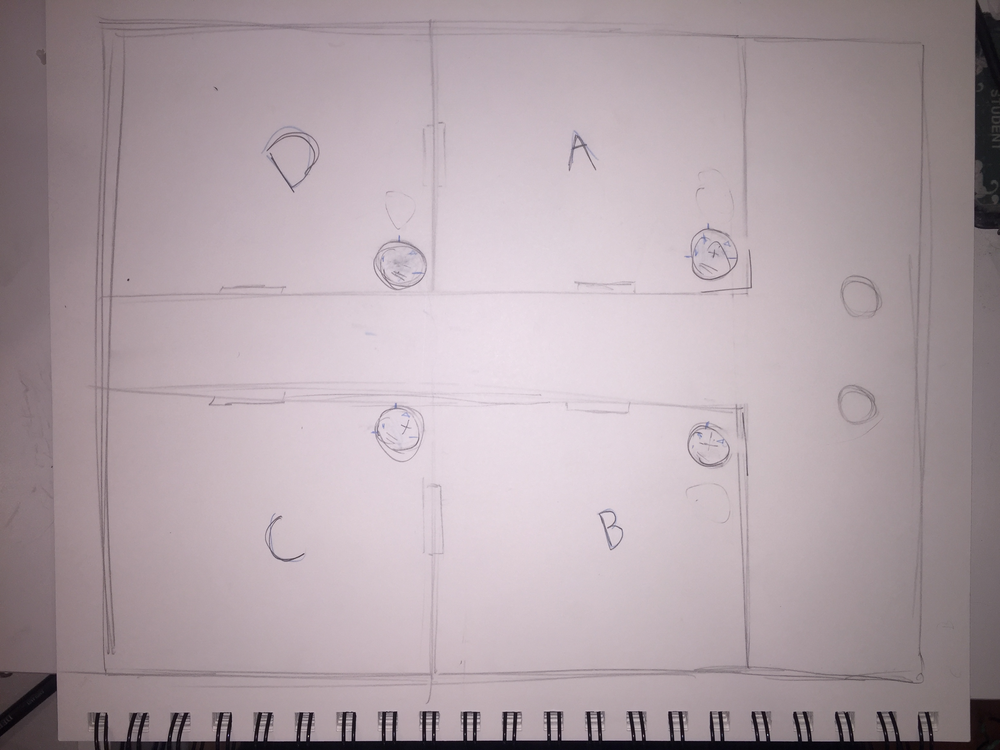

# Spaceship-Hybrid-Game

This project is a hybrid game that includes a React interface for two players that connects through wifi to an electronic board wired with an Arduino UNO to create a unique gaming experience.

## Summary

The Spaceship-Hybrid-Game is composed of two main parts: The electronic board and the React Interface. However, the game itself is about two survivors on a spaceship that has been infested with alien parasites. They have to collaborate by clearing four rooms and setting the ship for self-destruction. The electronic board would be made out of a piece of cardboard with a printed image in the top. The board will have LEDs, and small speakers that work as the physical pieces to provide information of where you are and what is happening on the game. The React App would be the mechanism of the user to control their own actions and sets the rules that would trigger the different commands. The interface should include one button for each room of the Spaceship, when pressed, they give the ability to move to these. It should also include buttons for the other two actions the player can do which are: Killing an Alien or Setting a room to self-destruct. A smaller box on the side of the screen should also work as a serial monitor where you can read what is happening with each movement or in each turn. 

The idea behind this project is to give the user a different gaming experience. A way to immerse the player with lights and sounds that would match with the main Space theme of the game.

## Component Parts

For the Hardware the main part is

## Rules of the Game

This section of the page is to introduce how the game works, the rules and mechanics.

The Spaceship-Hybrid-Game rules are inspired from the collaborative game Pandemic. In our game two specialized memebers of a Spaceship survive to the ever growing infestation of parasite aliens in the ship. The ship is doomed and the players' objective is to set it to self-destruct before escaping. To accomplish this goal they must go to each of the four rooms of the ship and initiate the self-destruction. When the game starts, the players will be located outside of the four rooms of the ship, a Mother Alien will be randomly located in one of the rooms and two other normal parasites will be also randomly located in any room. Players interact in turns, in one turn the player can do any of these three actions: Move, Kill, and Initiate.  

### Move
- If a player decides to move, he can go to any of the four rooms during the furst turn or to the adjacent rooms after the first turn.

### Kill
- With this action, the player kills one of the aliens in the room.

### Intitate
- This action sets the romm for elf-destruction. To be able to initiate self-destruction in one of the rooms, the room must be empty of parasite aliens. 

After the two users have played their turns the Mother Alien will spawn a parasite in the room she was inhabiting, and then move randomly to a different room, she could also stay in that same room. There can only be two parasites in each room, not counting the Mother Alien. If a third parasite is going to spawn in a room that already contained two parasites, it will create a chain reaction that will add an extra parasite on each adjacent room. If the players set all four rooms to self-destruct, they win, but if the aliens cover all the rooms, the players loose.

