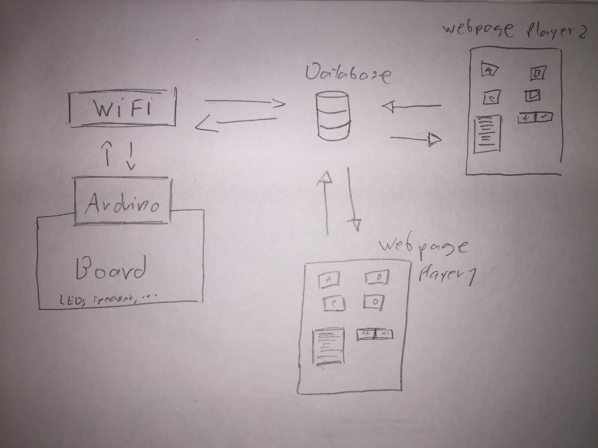

# Spaceship-Hybrid-Game

This project is a hybrid game that includes a React interface for two players that connects through wifi to an electronic board wired with an Arduino UNO to create a unique gaming experience.

## Summary

The Spaceship-Hybrid-Game is composed of two main parts: The electronic board and the React Interface. However, the game itself is about two survivors on a spaceship that has been infested with alien parasites. They have to collaborate by clearing four rooms and setting the ship for self-destruction. The electronic board would be made out of a piece of cardboard with a printed image in the top. The board will have LEDs, and small speakers that work as the physical pieces to provide information of where you are and what is happening on the game. The React App would be the mechanism of the user to control their own actions and sets the rules that would trigger the different commands. The interface should include one button for each room of the Spaceship, when pressed, they give the ability to move to these. It should also include buttons for the other two actions the player can do which are: Killing an Alien or Setting a room to self-destruct. A smaller box on the side of the screen should also work as a serial monitor where you can read what is happening with each movement or in each turn. 

The idea behind this project is to give the user a different gaming experience. A way to immerse the player with lights and sounds that would match with the main Space theme of the game.

## Component Parts

On the hardware side, there's a small box you plug into an outlet, into which you then plug in whatever electrical device you like. That box will need a few main components:
- An arduino board that controls the different components.
- Many different LEDs with different colors depending on what they represent (Player position, parasites, Mother Alien etc...).
- A speaker to add sound for alerts.
- A wifi chip, to transmit what the arduino is doing to the cloud and receive the button instructions from the cloud. 
- A cardboard game board where the different components are placed.

For the software, there's a web page that shows you the actions that you can do, the rooms where you can move and a monitor that updates on the latest thing that happened remotely, its components would be:
- A database, to store reported current usage data. (DATA)
- A user login system, to uniquely identify people coming to the site and connect to the correct devices.
- A monitor that communicates all the devices and updates on what is happening. (OUTPUT)
- A few buttons for the player to choose different actions in their turns. (INPUT)
- A way to block commands when it is not the turn of the player.

## Rules of the Game

This section of the page is to introduce how the game works, the rules and mechanics.

The Spaceship-Hybrid-Game rules are inspired from the collaborative game Pandemic. In our game two specialized memebers of a Spaceship survive to the ever growing infestation of parasite aliens in the ship. The ship is doomed and the players' objective is to set it to self-destruct before escaping. To accomplish this goal they must go to each of the four rooms of the ship and initiate the self-destruction. When the game starts, the players will be located outside of the four rooms of the ship, a Mother Alien will be randomly located in one of the rooms and two other normal parasites will be also randomly located in any room. Players interact in turns, in one turn the player can do any of these three actions: Move, Kill, and Initiate.  

### Move
- If a player decides to move, he can go to any of the four rooms during the furst turn or to the adjacent rooms after the first turn.

### Kill
- With this action, the player kills one of the aliens in the room.

### Intitate
- This action sets the romm for elf-destruction. To be able to initiate self-destruction in one of the rooms, the room must be empty of parasite aliens. 

After the two users have played their turns the Mother Alien will spawn a parasite in the room she was inhabiting, and then move randomly to a different room, she could also stay in that same room. There can only be two parasites in each room, not counting the Mother Alien. If a third parasite is going to spawn in a room that already contained two parasites, it will create a chain reaction that will add an extra parasite on each adjacent room. If the players set all four rooms to self-destruct, they win, but if the aliens cover all the rooms, the players loose.

### Block Diagram

## Challenges

For this project, the biggest test is going to be to make the basic rules of th e game to work, since i have little experience in coding games, how to structure them or write commands. Just getting the code of the game working might be challenging, but from the experience I have I think is doable. From assingments done in class I aquired knowledge and confidence to work connecting arduino to a react App. However, my knowledge is basic and I will have to expand on it to build some of the game's assets. An example of something that I am not sure how to accomplis is to be able to have two players only on the App. 

In the Arduino aspect of the project I feel confident since I have experience working with it, but there are still some difficulties involving the hardware. The arduino does not include enough ports for all the assents I would like to include, so I don't know how to overcome this problem and will have to look for solutions. 

I have little experience on building interfaces, but a rough one should work to get the first model going.

## Timeline

- Week 1: Write proposal, learn about coding games, might try an arduino only version first
- Week 2: Acquire hardware components: relay, current sensor, WiFi, and build a prototype circuit with those pieces.
- Week 3: Build a first version of the software that displays all the buttons and commands.
- Week 4: Integrate all the components together and debug.
- Week 5: Present complete project.

